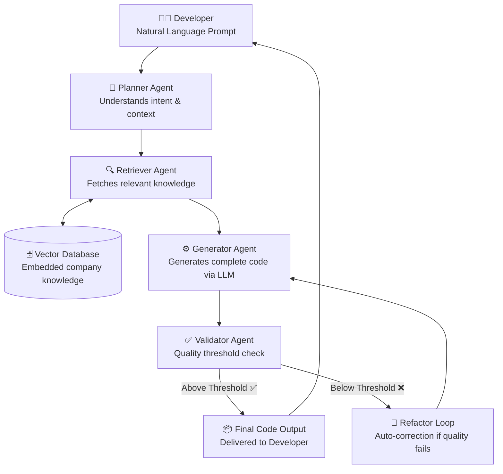
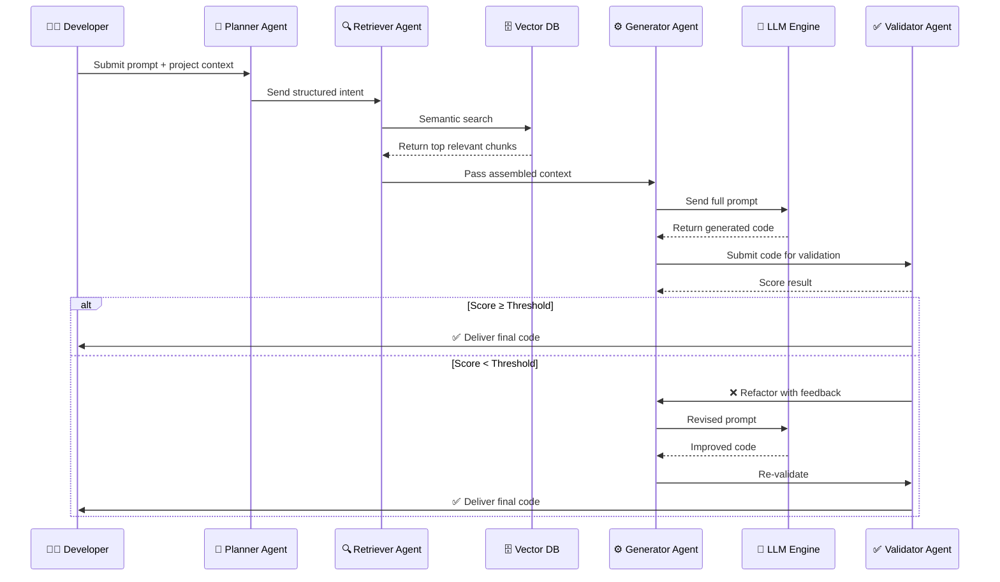
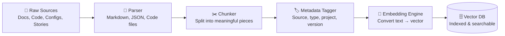

# AI-Powered Internal Coding Assistant
### Technical Design Document

> **Document Type:** System Design & Architecture
> **Audience:** CTOs, Architects, Developers, Non-Technical Stakeholders
> **Version:** 1.0
> **Status:** Draft

---

## Table of Contents

1. [Overview](#1-overview)
2. [Goal of the Project](#2-goal-of-the-project)
3. [Proposed Solution](#3-proposed-solution)
4. [How It Works](#4-how-it-works)
5. [What Knowledge It Will Use](#5-what-knowledge-it-will-use)
6. [Key Benefits](#6-key-benefits)

---

## 1. Overview

> 💡 **For Non-Technical Readers:** Think of this system as a highly knowledgeable internal assistant — like having a senior developer always available who knows every document, every standard, and every past project in the company. A developer simply describes what they need to build, and the assistant provides complete, ready-to-use code — not just a blank template.

Our company currently uses an internal toolkit that helps developers set up the **basic skeleton** of a project — folder structure, config files, and starter code — through a JSON configuration. While useful, this still requires significant manual effort to write the actual working logic.

This project proposes building an **AI-powered internal coding assistant** that goes beyond skeleton generation. It understands a developer's requirement in plain language, searches the company's internal knowledge base, and produces **complete, production-ready code** — validated before delivery.

### Current Approach vs. Proposed Approach

| Dimension | Current System | Proposed System |
|---|---|---|
| **Input** | JSON configuration file | Natural language prompt + project context |
| **Output** | Basic folder/file skeleton | Complete, working code modules |
| **Knowledge Usage** | Static documentation | Actively searched and applied |
| **Standards Enforcement** | Developer's responsibility | Automated via agent validation |
| **Validation** | None | Built-in quality threshold + auto-refactoring |
| **Developer Effort Post-Generation** | High — all logic must be written manually | Low — code is ready to review and use |

---

## 2. Goal of the Project

The primary goal is to build an intelligent assistant that helps developers generate **complete, ready-to-use code solutions** — moving beyond template generation to meaningful, working implementations.

### Specific Goals

- **Reduce Development Time** — Minimize manual coding effort; move faster from requirement to working solution
- **Utilize Internal Knowledge Effectively** — Convert scattered resources (docs, configs, past code) into an active, usable system
- **Enforce Consistency** — Automatically generate code that follows company-defined standards and architecture
- **Improve Code Quality** — Use proven past implementations and known error patterns to produce more reliable code
- **Reduce Repetitive Work** — Automate common modules and frequently repeated logic across projects
- **Simplify Onboarding** — Help new developers access internal knowledge quickly without relying on senior developers
- **Enable Faster Project Delivery** — Shorten development cycles to help teams deliver to clients more efficiently
- **Build a Future-Ready Foundation** — Establish a platform that can later support auto-debugging, test generation, and deeper IDE integration

---

## 3. Proposed Solution

> 💡 **Simple Explanation:** Instead of the developer having to manually search documentation, study past code, and write everything from scratch — this system does the heavy lifting. The developer describes what they need, and the system researches, assembles context, and writes the code on their behalf.

We propose building an **agent-based AI pipeline** that acts as a smart layer on top of the existing toolkit. It takes a developer's plain-language request, retrieves the most relevant internal knowledge, generates complete code, and validates it — all automatically.

### High-Level Architecture



### Agent Roles

The system is built around four specialized agents, each with a clearly defined responsibility:

#### 🧠 Planner Agent
Analyzes the developer's input to understand **what needs to be built**, which project and module it relates to, and what type of knowledge should be retrieved.

| Responsibility | Description |
|---|---|
| Intent Classification | Is this a new feature, bug fix, config, or refactor? |
| Context Identification | Which project, module, and user story does this relate to? |
| Retrieval Strategy | What types of knowledge are needed — code, docs, standards? |

**Input:** Developer prompt + project metadata → **Output:** Structured intent with retrieval directives

---

#### 🔍 Retriever Agent
Searches the vector database for the most relevant knowledge chunks — using **semantic search** (meaning-based, not keyword-based).

> 💡 **Simple Explanation:** A regular search finds documents containing the exact words you typed. Semantic search understands *what you mean* — so searching "user login" also finds "authentication module" and "sign-in handler" because they mean the same thing.

| Responsibility | Description |
|---|---|
| Semantic Search | Finds knowledge by meaning, not just keywords |
| Result Ranking | Prioritizes by relevance, recency, and source type |
| Context Assembly | Selects the best chunks within the LLM's processing limit |

**Input:** Structured intent → **Output:** Ranked, relevant knowledge chunks

---

#### ⚙️ Generator Agent
Assembles a complete prompt — combining the developer's request with retrieved knowledge — and sends it to the LLM to generate code.

| Responsibility | Description |
|---|---|
| Prompt Assembly | Combines query + retrieved context + output format instructions |
| LLM Invocation | Sends the prompt to the configured AI model |
| Output Structuring | Formats and organizes the generated code |

**Input:** Developer query + retrieved context → **Output:** Complete generated code

---

#### ✅ Validator Agent
Reviews the generated code against a quality threshold before delivery. If it doesn't pass, it sends specific, targeted feedback back to the Generator for correction.

| Validation Dimension | Weight |
|---|---|
| Standards Compliance (naming, structure, patterns) | 30% |
| Completeness (is the full requirement addressed?) | 30% |
| Correct Internal Library/API Usage | 20% |
| Error Pattern Avoidance | 10% |
| Code Formatting & Readability | 10% |

**Threshold Logic:**
```
IF quality_score >= threshold (e.g., 80/100):
    → Deliver to developer ✅
ELSE:
    → Generate targeted feedback
    → Send back to Generator for correction
    → Re-validate (up to max retry limit)
```

---

## 4. How It Works

> 💡 **Simple Explanation:** A developer types what they need. The system reads it, finds relevant internal knowledge, writes the code, checks it, and hands back a finished result — all without the developer needing to search anything manually.

### End-to-End Sequence



### Step-by-Step Breakdown

**Step 1 — Developer Submits a Requirement**
The developer describes what they need in plain language — for example: *"Create an order management API for the client project."* No detailed technical specs are required.

**Step 2 — Planner Agent Analyzes the Request**
The system identifies the task type, the relevant project and module, and the user story it maps to. It structures this into a clear processing directive for the next agents.

**Step 3 — Retriever Agent Searches Internal Knowledge**
The system semantically searches the vector database — retrieving the most relevant documentation, past code, configs, error patterns, and standards. It ranks and selects the best pieces within the AI model's processing capacity.

**Step 4 — Generator Agent Produces the Code**
A complete prompt is assembled — containing the developer's request, retrieved knowledge, coding standard rules, and output formatting instructions — and sent to the LLM. The model returns structured, complete code.

**Step 5 — Validator Agent Checks Quality**
The generated code is scored across multiple dimensions. If it meets the threshold, it is delivered. If not, targeted feedback is generated and the code is automatically corrected and re-validated.

**Step 6 — Code Delivered to Developer**
The developer receives complete, structured code — ready to review, test, and deploy. They retain full control to modify or extend the output as needed.

---

## 5. What Knowledge It Will Use

> 💡 **Simple Explanation:** Before the system can help developers, it needs to "read" all of the company's existing knowledge — documents, past code, rules, and more. This is done once (and kept updated), so the system always has accurate, company-specific context to work from.

All knowledge is converted into a searchable format and stored in a **Vector Database** — enabling the system to find relevant information by meaning, not just keywords.

### Knowledge Ingestion Pipeline



### Knowledge Sources

| # | Knowledge Source | What It Contains | Why It Matters |
|---|---|---|---|
| 1 | **README / Markdown Docs** | Textual explanations, Mermaid diagrams, usage guides | Gives the system architectural and component-level understanding |
| 2 | **JSON Configurations** | Project setup, module structure, toolkit configs | Ensures generated configs align with existing toolkit patterns |
| 3 | **Coding Standards & Guidelines** | Naming conventions, structural rules, best practices | Automatically enforces company-wide consistency in output |
| 4 | **Verified Past Code** | Production-ready, manually reviewed implementations | Acts as a trusted reference for proven, reliable patterns |
| 5 | **Error Patterns & Fixes** | Known bugs, anti-patterns, and their solutions | Helps the system avoid repeating past mistakes |
| 6 | **User Stories** | Feature descriptions, acceptance criteria | Provides business-level context so code matches actual requirements |
| 7 | **API Specifications** | Endpoint contracts, request/response formats | Ensures generated code integrates correctly with existing APIs |
| 8 | **Database Schemas** | Table structures, relationships, data models | Ensures correct data handling and backend logic generation |
| 9 | **Project Folder Structure** | Directory conventions, file placement rules | Ensures generated files are placed in the correct locations |
| 10 | **Internal Libraries / Utilities** | Shared packages, reusable components | Encourages code reuse and prevents reinventing existing solutions |
| 11 | **Test Cases** | Unit tests, expected inputs/outputs | Helps validate generated logic against proven test scenarios |
| 12 | **API / Library Changelogs** | Version-specific behavior, breaking changes | Prevents the system from generating code using outdated internal APIs |

---

## 6. Key Benefits

> 💡 **Simple Explanation:** Here is what the company and its developers gain from building this system.

### For Developers

| Benefit | Description |
|---|---|
| **Faster Development** | Generate complete code modules in seconds instead of writing everything from scratch |
| **Less Repetitive Work** | Common logic, boilerplate, and standard modules are automated |
| **Better Code Quality** | Output is grounded in proven past implementations and enforced standards |
| **Instant Knowledge Access** | No more searching through docs or asking colleagues — the system knows it all |
| **Easier Onboarding** | New developers get up to speed faster with AI-assisted guidance |

### For the Business

| Benefit | Description |
|---|---|
| **Faster Project Delivery** | Shorter development cycles mean quicker delivery to clients |
| **Consistent Output Across Teams** | Every developer produces code aligned with the same internal standards |
| **Better Use of Company Knowledge** | Scattered documentation and past code become an active, usable resource |
| **Reduced Dependency on Senior Developers** | Junior developers can produce standard-compliant code without constant guidance |
| **Scalable Foundation** | The platform can grow to support auto-debugging, test generation, and CI/CD integration in future phases |

---

> *Document prepared for internal planning and review. All architecture decisions are subject to revision based on technical evaluation, tooling selection, and organizational requirements.*
